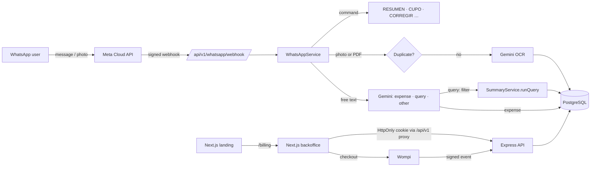

# none-system

Full-stack monorepo for an accounting platform that manages DIAN electronic invoices, bank transfer receipts and receipt-less expenses in **Colombia (COP)**, powered by multimodal AI (Google Gemini) and a conversational bot built on the **official WhatsApp Business API (Meta)**.

---

## 📖 Core Abstract & Functional Overview

| Feature | Channel | Description |
|---|---|---|
| AI receipt reading | WhatsApp · Web | Photo or PDF of invoices, receipts and transfers → merchant, NIT with check digit, CUFE, taxable base, VAT 19/5 %, consumption tax 8 %, total in COP |
| Receipt-less expenses | WhatsApp · Web | Free text (`arroz 5000`, `ayer taxi 12 mil`, several per message); `manual` type, never tax-deductible |
| Natural-language questions | WhatsApp | "¿cuánto gasté en transporte el trimestre pasado?": Gemini turns the question into a filter and the backend computes the figures |
| Guided corrections | WhatsApp | `Corregir` / `Deshacer` buttons and `CORREGIR`/`CAMBIAR` command on the latest record (24 h) |
| Caption instructions | WhatsApp | `categoria transporte`, `beneficiario EPM`, `valor 50 mil`, `fecha 29/09/2026`, `nota …` override the AI |
| Duplicate detection | WhatsApp · Web | Same file (SHA-256), same CUFE or same reference + amount → rejected without charging quota |
| Bounded summaries | WhatsApp · Web | `RESUMEN`, `RESUMEN SEPTIEMBRE`, `RESUMEN 2025`, `DETALLE`, `MESES`, grouped by document date |
| Welcome & menu | WhatsApp | One-time welcome image, consent via buttons, native list menu, `/` commands and ice breakers |
| Plans & quotas | WhatsApp · Web | Free: 5 receipts + 30 written expenses/month; paid plans include unlimited written expenses |
| Payments | Web | Wompi Web Checkout (PSE, card, Nequi, Bancolombia button) with idempotent plan activation |
| Habeas Data (Law 1581) | WhatsApp · Web | Explicit consent, free data export and account deletion |
| Accounting export | Web | Excel/CSV with `;` delimiter and UTF-8 BOM (Siigo, Alegra, World Office) |

---

## 📁 Monorepo Structure

- **`apps/landing`** (Port 3001):
  - **Marketing and sales site** built with **Next.js 15 (App Router)**.
  - **Interactive AI demo**: Real-time simulation of scanning Colombian receipts (Éxito, Nequi/Bancolombia transfers, restaurants with 8 % consumption tax) using fictitious demo data.
  - **Interactive ROI calculator**: Dynamic estimate of hours saved and return on investment in COP based on business volume (illustrative estimate).
  - **Plans & pricing in COP**:
    - *Free plan*: 5 photo/PDF receipts + 30 written expenses/month ($0 COP)
    - *Independent plan*: 50 receipts/month + unlimited written expenses ($19,900 COP/month)
    - *Business plan*: 200 receipts/month + unlimited written expenses ($49,900 COP/month)
    - *Enterprise plan*: 600 receipts/month + unlimited written expenses ($99,900 COP/month)
  - **Plan purchase**: redirects to the backoffice (`/billing`), where the user pays with Wompi from their account with a verified phone number. The landing **never collects card data**.
  - **Legal pages**: `/privacidad` (Personal Data Processing Policy, Law 1581) and `/terminos` (Terms and Conditions, Law 1480). Data controller details are configured in `src/lib/legal.ts` or through `NEXT_PUBLIC_LEGAL_*` variables.
  - Details: [`apps/landing/README.md`](apps/landing/README.md).

- **`apps/backoffice`** (Port 3000):
  - **Private accounting and administration panel** built with **Next.js 15 (App Router)**.
  - **Atomic Design** (Atoms, Molecules, Organisms, Templates) in a **luxury dark mode** with **turquoise / electric blue** accents.
  - **Side-by-side viewer**: original receipt on the left, accounting verification form on the right; manual expenses are shown as "no supporting document".
  - **Advanced filters and Excel/CSV export**: accounting export with `;` delimiter and UTF-8 BOM for Colombian Excel, compatible with Siigo, Alegra and World Office.
  - **Account & security**: two-step sign-up with a WhatsApp code, HttpOnly cookie session, plans and payments (`/billing`), manual expense form (`/expenses/new`), data export and account deletion.
  - **Automated tests**: 50 unit and integration tests with Vitest, React Testing Library and MSW (Mock Service Worker).
  - Details: [`apps/backoffice/README.md`](apps/backoffice/README.md).

- **`apps/backend`** (Port 4000):
  - REST API built with **Express.js + TypeScript** on PostgreSQL (Prisma).
  - Multimodal OCR with **Google Gemini** (`gemini-3.5-flash-lite`, `gemini-3.1-flash-lite` and `GEMINI_MODEL`, with automatic failover when a model is overloaded), tailored to Colombia (VAT 19 %, consumption tax 8 %, NIT with check digit, bank transfers).
  - **Meta WhatsApp Cloud API integration**: official webhook (`/api/v1/whatsapp/webhook`) verified with `X-Hub-Signature-256`, welcome image and consent buttons, interactive messages (buttons and lists), commands (`RESUMEN`, `DETALLE`, `MESES`, `CUPO`, `CORREGIR`/`CAMBIAR`, `DESHACER`, `CANCELAR`, `WEB`, `PRIVACIDAD`, `ELIMINAR MIS DATOS`) and natural-language questions.
  - **Three record types**: `factura` (invoice or receipt with photo/PDF), `transferencia` (bank receipt with photo/PDF) and `manual` (text without supporting document, e.g. "arroz 5000"; consumes the written-expense quota and is never tax-deductible).
  - **Subscriptions & payments module**: atomic monthly quotas per WhatsApp number, paid-plan expiration, Wompi checkout (`/api/v1/subscriptions`, `/api/v1/payments`).
  - **Swagger / OpenAPI documentation**: available at `/docs` and `/api-docs` (disabled in production).
  - Details: [`apps/backend/README.md`](apps/backend/README.md).

---

## 🚀 Architectural Runtime Flow



---

## 🗂️ Directory Tree

```text
none-system/
├── apps/
│   ├── backend/              # Express API + Prisma + WhatsApp bot
│   │   ├── assets/           # Bot welcome image (welcome.jpg + HTML source)
│   │   ├── prisma/           # schema.prisma, seed (admin only) and data-fixes/*.sql
│   │   ├── scripts/          # e2e, webhook simulation, whatsapp-setup, purge-dev-data
│   │   ├── src/              # config, core (security, email, storage), modules, providers
│   │   └── test/             # 38 tests with node:test
│   ├── backoffice/           # Web panel (Next.js 15, Atomic Design, Vitest + MSW)
│   └── landing/              # Marketing site and legal pages (Next.js 15)
├── docker-compose.yml        # PostgreSQL 16 for development
├── package.json              # Monorepo scripts (pnpm workspaces)
└── pnpm-workspace.yaml
```

---

## 🛠️ Technical Stack & Dependencies

| Layer | Technology | Version |
|---|---|---|
| Runtime | Node.js · pnpm | `>= 20` · `>= 10` |
| API | `express` · `zod` · `jsonwebtoken` · `bcryptjs` · `multer` | `^4.21.2` · `^3.24.2` · `^9.0.3` · `^3.0.3` · `^1.4.5-lts.1` |
| Database | `prisma` · `@prisma/client` · PostgreSQL | `6.19.3` · `^6.19.3` · `16` (Docker) |
| AI | `@google/genai` | `^2.26.0` |
| Frontend | `next` · `react` · `@tanstack/react-query` · `tailwindcss` | `^15.1.7` · `^19.0.0` · `^5.104.0` · `^3.4.17` |
| Testing | `node:test` + `tsx` · `vitest` · `msw` · `@testing-library/react` | `^4.19.3` · `^5.0.3` · `^3.0.1` · `^16.3.3` |
| Integrations | Meta WhatsApp Cloud API · Wompi · Resend | `v21.0` · Web Checkout + events · REST API |

---

## 🚀 Quick Start

### 1. Requirements
- Node.js >= 20
- [pnpm](https://pnpm.io/) >= 10
- PostgreSQL 16 (e.g. with `docker compose up -d`)

### 2. Install dependencies
```bash
pnpm install
```

### 3. Run the services in development

```bash
# Start the marketing & payments landing (http://localhost:3001):
pnpm dev:landing

# Start the accounting backoffice (http://localhost:3000):
pnpm dev:backoffice

# Start the backend API + WhatsApp webhook + Swagger (http://localhost:4000):
pnpm dev:backend
```

### 4. Database
```bash
pnpm db:push                # applies the Prisma schema
pnpm db:seed                # admin account only, no sample data (production requires SEED_ADMIN_PASSWORD)

# Purge test data: keeps only the admin, with zero usage (disabled in production)
pnpm --filter @none-system/backend db:purge
```

The scripts in `apps/backend/prisma/data-fixes/` fix data in existing environments after schema changes and must be run once:
```bash
cd apps/backend
npx prisma db execute --file prisma/data-fixes/<file>.sql --schema prisma/schema.prisma
```

### 5. Configure the bot on Meta
```bash
# Enables the automatic welcome message, "/" commands and ice breakers for the number
pnpm --filter @none-system/backend whatsapp:setup
```

### 6. Automated tests
```bash
pnpm test           # backend (node:test) + backoffice (Vitest)
pnpm test:backend   # backend only: security, data isolation, payments, WhatsApp and queries
```

---

## ⚙️ Provisioning & Setup Guide · Environment Variables

Each app reads its own environment file. The full list, with defaults and requirements, is in each app's README.

| File | Template | Key variables |
|---|---|---|
| `apps/backend/.env` | [`apps/backend/.env.example`](apps/backend/.env.example) | `DATABASE_URL`, `GEMINI_API_KEY`, `JWT_SECRET`, `ENCRYPTION_SECRET`, `WHATSAPP_*`, `WOMPI_*`, `RESEND_API_KEY`, `CORS_ORIGINS`, `BACKOFFICE_URL`, `LANDING_URL` |
| `apps/backoffice/.env.local` | — | `INTERNAL_API_ORIGIN`, `NEXT_PUBLIC_API_URL`, `INTERNAL_API_URL`, `NEXT_PUBLIC_LANDING_URL` |
| `apps/landing/.env.local` | — | `NEXT_PUBLIC_BACKOFFICE_URL`, `NEXT_PUBLIC_WHATSAPP_NUMBER`, `NEXT_PUBLIC_LEGAL_*`, `NEXT_PUBLIC_PRIVACY_EMAIL`, `NEXT_PUBLIC_SUPPORT_EMAIL` |

Generating strong secrets:
```bash
openssl rand -base64 48   # JWT_SECRET and ENCRYPTION_SECRET (at least 32 characters in production)
```

> [!WARNING]
> `ENCRYPTION_SECRET` encrypts supporting documents at rest. If it changes or is lost, existing encrypted files can no longer be opened.

---

## 🔐 Security & Compliance

- **Data isolation**: every expense, summary, payment and file route requires a session; each user only accesses their own data (anything else returns 404).
- **Verified phone number**: web sign-up requires an OTP sent over WhatsApp; the bot only links data to verified numbers.
- **Encrypted documents**: images and PDFs are stored with AES-256-GCM (`ENCRYPTION_SECRET`), random file names and *magic bytes* validation, and are served only to their owner.
- **Habeas Data**: explicit consent (web and WhatsApp), free data export and account deletion (web or `ELIMINAR MIS DATOS`).
- **Production**: the backend refuses to start without `DATABASE_URL`, strong `JWT_SECRET`/`ENCRYPTION_SECRET`, `WHATSAPP_APP_SECRET` and its own verify token; Swagger and simulated payments are disabled.
- **Sessions**: JWT in an HttpOnly + SameSite=Lax cookie, `Origin` checks on writes (CSRF) and revocation through `sessionVersion` (password change, "sign out everywhere", account deletion).
- **Payments**: Wompi Web Checkout with integrity signature; the plan is activated only by the signed event or a direct query to Wompi, validating amount and currency, exactly once per payment.
- **Scoped AI**: for natural-language queries Gemini only returns a validated filter; it never receives expense data nor computes figures.
- **Persistent bot state**: `DESHACER`/`CORREGIR`/deletion state and Meta message deduplication live in PostgreSQL.
- **Pending before launch**: real legal entity data in `apps/landing/src/lib/legal.ts`, an approved Meta authentication template for OTPs (`WHATSAPP_OTP_TEMPLATE_NAME`), Wompi production keys, a verified Resend domain and a legal review of the legal texts.

---

## 📈 Performance / Resilience

- **Atomic quotas**: receipt and written-expense usage is reserved with `UPDATE … WHERE usage < limit` in PostgreSQL; failed or duplicate processing returns the quota.
- **Duplicates before AI**: the file's SHA-256 fingerprint is checked before spending quota or Gemini calls.
- **Model failover**: OCR and the message interpreter try several Gemini models; if the AI is unavailable, a deterministic interpreter handles common expenses and queries.
- **Bounded messages**: no bot reply exceeds 3,800 characters; lists and breakdowns are capped and point to the web panel.
- **Graceful degradation**: if Meta rejects an interactive message (buttons, lists or image), a plain-text version is sent.

---

> This digital ecosystem has been designed, structured, and developed to high-performance standards by **[Cabuweb](https://cabuweb.com)** - **Software Developer: Diego Villa**.
