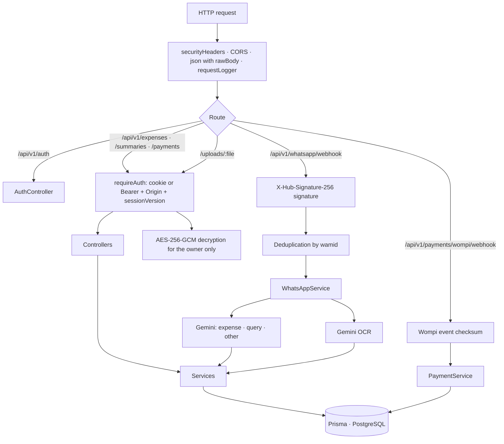

# @none-system/backend

REST API built with **Express.js** and **TypeScript**, following a modular architecture and SOLID principles, for digitizing and analyzing financial receipts in **Colombia** with AI (**Google Gemini**), with persistence in **PostgreSQL (Prisma)** and a conversational bot on the **official WhatsApp Business API (Meta)**.

---

## 📖 Core Abstract & Functional Overview

| Module | Responsibility |
|---|---|
| `auth` | Two-step sign-up with WhatsApp OTP, JWT session in an HttpOnly cookie, revocation via `sessionVersion`, password recovery by code, email verification, account deletion |
| `expenses` | AI scanning, manual expenses, editing with DIAN rules, duplicate detection, natural-language query interpretation |
| `summaries` | Monthly and yearly summaries, latest records, months with data and filtered query execution |
| `subscriptions` | Plans, atomic quotas for receipts and written expenses, monthly cycles in Colombia time, paid-plan expiration |
| `payments` | Wompi Web Checkout, signed event verification, reconciliation after checkout, idempotent plan activation |
| `whatsapp` | Signed webhook, welcome image, consent buttons, list menu, commands, guided corrections, caption instructions, queries |
| `core` | AES-256-GCM encryption, file type detection, rate limiting, security headers, email (Resend), local storage |

---

## 🇨🇴 Financial & Accounting Context (Colombia)

- **Base currency**: Always **Colombian pesos (COP)**.
- **Supported document types**:
  1. **`factura`**: Commercial electronic sales invoices (Alkomprar, Éxito, D1, restaurants), POS tickets and receipts: NIT, CUFE, VAT breakdown (19%/5%), consumption tax (8%) and itemized lines. Only an invoice with a NIT can be flagged as meeting the formal requirements of Art. 771-2 of the Tax Code.
  2. **`transferencia`**: Payment receipts, bank transfers, deposits and correspondent-banking slips (Bancolombia, Wompi, Nequi, Daviplata, Efecty). The expense is assigned to the **beneficiary/agreement**, extracting the bank and approval/reference number and omitting VAT.
  3. **`manual`**: Written expense without a supporting document (e.g. `arroz 5000`). It has no image, consumes the written-expense quota and is **never** tax-deductible.
  4. **`auto`** (scan only): The AI classifies the document type automatically.
- **Dates**: the document date is normalized to `YYYY-MM-DD` (accepts `2025/10/29`, `29/10/2025`, `29 oct 2025`…); if it is unreadable or in the future, today's date is used and the record is kept as a draft.

---

## 🏛️ Architecture & Principles

- **Modular architecture (vertical slices)**: Independent modules (`auth`, `expenses`, `summaries`, `subscriptions`, `payments`, `whatsapp`).
- **SOLID**:
  - **S (Single Responsibility)**: Controllers (HTTP), Services (business logic), Repositories (persistence), Providers (external integrations).
  - **O (Open/Closed) & D (Dependency Inversion)**: OCR extractor (`IOcrExtractor`), message interpreter (`IMessageInterpreter`), storage (`IStorageService`), conversation state (`IConversationStateStore`) and payments (`IPaymentRepository`) are decoupled behind interfaces.
  - **L (Liskov Substitution)**: Repositories are interchangeable (in-memory for tests, PostgreSQL at runtime) without touching business code.
- **DRY & KISS**: Input validation and strict TypeScript typing unified with **Zod**.
- **YAGNI**: No over-engineering or premature queues. A lean, robust modular monolith.

---

## 🚀 Architectural Runtime Flow



---

## 🗂️ Directory Tree

```text
apps/backend/
├── assets/
│   ├── welcome.jpg                 # Bot welcome image (1600×838)
│   └── welcome/welcome.html        # Editable source of the image
├── prisma/
│   ├── schema.prisma               # users, subscriptions, expenses, payment_transactions, phone_verifications,
│   │                               # conversation_states, processed_webhook_messages
│   ├── seed.ts                     # Admin account only, with zero usage
│   └── data-fixes/*.sql            # One-time data fixes for existing environments
├── scripts/
│   ├── e2e-test.ts                 # End-to-end test with the real Gemini API
│   ├── whatsapp-test.ts            # Webhook simulation (no real messages are sent)
│   ├── whatsapp-setup.ts           # Automatic welcome, "/" commands and ice breakers on Meta
│   └── purge-dev-data.ts           # Test data purge (disabled in production)
├── src/
│   ├── config/env.ts               # Environment validation (strict in production)
│   ├── core/
│   │   ├── email/                  # Resend + transactional templates
│   │   ├── middlewares/            # errors, logger, rate limiting, headers, file upload
│   │   ├── security/               # AES-256-GCM, HMAC, magic bytes, personal data masking
│   │   ├── storage/                # Encrypted local storage
│   │   └── utils/dates.ts          # Colombia-time dates, normalization and ranges
│   ├── modules/
│   │   ├── auth/                   # controllers, dtos, entities, middlewares, repositories, services, verification (OTP)
│   │   ├── expenses/               # controllers, dtos, entities, repositories, services, manual, duplicates, query
│   │   ├── payments/               # Wompi client, repository, service, routes
│   │   ├── subscriptions/          # Plans, billing periods, quotas
│   │   ├── summaries/              # Summaries and queries
│   │   └── whatsapp/               # webhook, service, messaging, corrections, captions, welcome, bot profile
│   ├── providers/ocr/              # GeminiExtractor (OCR + message interpreter)
│   ├── docs/openapi.ts             # OpenAPI 3 specification
│   ├── app.ts                      # Dependency composition root
│   └── server.ts                   # Startup and graceful shutdown
└── test/                           # 38 tests (node:test)
```

---

## 📖 Interactive Documentation (Swagger UI)

Once the server is running in development, open:
👉 **[http://localhost:4000/docs](http://localhost:4000/docs)** (or `/api-docs`)  
👉 **OpenAPI JSON specification**: `http://localhost:4000/docs/openapi.json`

Swagger is not exposed in production.

---

## 🚀 Main Endpoints

Every data route requires a session: the `none_auth_token` cookie (browser, with an allowed `Origin` on writes) or `Authorization: Bearer <token>`.

### 1. AI Scanning & Extraction
- **`POST /api/v1/expenses/scan`**
  - **Content-Type**: `multipart/form-data`
  - **Fields**:
    - `file`: Image or PDF (JPG, PNG, WEBP, HEIC, PDF; max 5 MB). The real type is validated through *magic bytes*.
    - `tipo`: `'factura'` | `'transferencia'` | `'auto'` (optional, defaults to `'auto'`).
  - Consumes 1 receipt from the quota; if processing fails or the receipt is a duplicate, the quota is returned.
  - **`409`** for duplicates (same file, same CUFE or same reference + amount). **`402`** when the quota is exhausted.
  - If a very similar record exists, the response includes `warning.code = "POSSIBLE_DUPLICATE"`.
  - **Sample response (Transfer / Bancolombia - Wompi payment)**:
    ```json
    {
      "success": true,
      "data": {
        "id": "uuid",
        "tipoDocumento": "transferencia",
        "comercio": "FUNERARIA SAN VICENT",
        "entidadFinanciera": "Bancolombia / Wompi",
        "numeroReferencia": "42756870",
        "fecha": "2026-09-26",
        "subtotal": null,
        "impuestos": null,
        "total": 50000,
        "moneda": "COP",
        "categoria": "Hogar y Servicios",
        "lineasArticulos": [
          { "descripcion": "Recaudo de factura - FUNERARIA SAN VICENT", "precio": 50000 }
        ],
        "confianzaExtraccion": "alta",
        "imageUrl": "/uploads/1790956849624-6f1c2a3e.png",
        "source": "web",
        "estado": "confirmado"
      }
    }
    ```
  - **Sample response (Alkomprar commercial invoice)**:
    ```json
    {
      "success": true,
      "data": {
        "id": "uuid",
        "tipoDocumento": "factura",
        "comercio": "ALKOMPRAR",
        "cifNif": "890900943-1",
        "numeroReferencia": "X9722525757",
        "fecha": "2025-10-29",
        "subtotal": 4032731,
        "impuestos": 766219,
        "total": 4798950,
        "moneda": "COP",
        "categoria": "Tecnología",
        "lineasArticulos": [
          { "descripcion": "TV SAMSUNG 55\" 55Q7F+ BarC400", "precio": 2199900 },
          { "descripcion": "L/S SAM CF 11,5Kg WD11T4046B\"I", "precio": 2599050 }
        ],
        "confianzaExtraccion": "alta"
      }
    }
    ```

### 2. Expense Management in COP
- **`POST /api/v1/expenses/manual`**: Expense without a supporting document (`descripcion`, `total`, `fecha?`, `categoria?`, `comercio?`, `cantidad?`, `notas?`). Consumes the written-expense quota.
- **`GET /api/v1/expenses`**: The user's own expenses with optional filters (`?tipoDocumento=manual&year=2026&month=9&categoria=Tecnología&comercio=Alkomprar`).
- **`GET /api/v1/expenses/:id`**: Full detail of an owned expense.
- **`PUT /api/v1/expenses/:id`**: Update or confirm user-edited data (a manual expense cannot become an invoice nor be tax-deductible).
- **`DELETE /api/v1/expenses/:id`**: Delete an expense and its encrypted supporting document.
- **`GET /uploads/:file`**: Downloads the decrypted supporting document, for its owner only.

### 3. Summaries & WhatsApp Messages in Colombian Pesos
- **`GET /api/v1/summaries/monthly?year=2026&month=9`**: Monthly metrics by type (invoices, transfers, written expenses) and category.
- **`GET /api/v1/summaries/whatsapp-text?year=2026&month=9`**: Message formatted for WhatsApp with progress bars and COP ($) amounts.
- An administrator can query another user with `&userId=`.

### 4. Authentication & Account
| Method | Route | Description |
|---|---|---|
| `POST` | `/api/v1/auth/register` | Step 1: validates data and sends a WhatsApp OTP (`202`) |
| `POST` | `/api/v1/auth/register/confirm` | Step 2: verifies the code, creates the account and issues the session cookie |
| `POST` | `/api/v1/auth/login` · `/logout` · `/logout-all` | Sign in, sign out of the current session or of all sessions |
| `POST` | `/api/v1/auth/forgot-password` · `/reset-password` | Recovery code sent to the verified WhatsApp number |
| `POST` | `/api/v1/auth/verify-email` · `/email/resend` | Email verification (Resend) |
| `POST` | `/api/v1/auth/phone/send-code` · `/phone/verify` | Phone verification for legacy accounts |
| `GET` · `DELETE` | `/api/v1/auth/me` | Profile and subscription · account deletion with password |

### 5. Subscriptions & Payments
| Method | Route | Description |
|---|---|---|
| `GET` | `/api/v1/subscriptions/plans` | Plans, prices and payment mode (`wompi` · `simulated` · `disabled`) |
| `GET` | `/api/v1/subscriptions/me` | The user's quotas |
| `POST` | `/api/v1/subscriptions/checkout` | Returns the Wompi Web Checkout URL (or activates in test mode) |
| `POST` | `/api/v1/payments/wompi/webhook` | Signed Wompi events |
| `GET` | `/api/v1/payments/wompi/confirm?id=` | Reconciliation after returning from checkout |
| `GET` | `/api/v1/payments/:reference` | Status of an owned order |

### 6. WhatsApp
- **`GET /api/v1/whatsapp/webhook`**: Webhook verification by Meta (`hub.verify_token`).
- **`POST /api/v1/whatsapp/webhook`**: Incoming messages (text, image, document, interactive replies, `request_welcome`), validated with `X-Hub-Signature-256`.

| The user sends | The bot |
|---|---|
| First contact | Welcome image and data-processing consent with `Acepto` / `No acepto` buttons |
| Photo or PDF (optional caption) | Checks duplicates, reads it with AI, applies caption data and confirms with `Corregir` / `Deshacer` buttons |
| `arroz 5000, aceite 12000` | Records two written expenses |
| "¿cuánto gasté en transporte el trimestre pasado?" | Answers with totals computed by the backend |
| `RESUMEN` · `RESUMEN SEPTIEMBRE` · `RESUMEN 2025` · `DETALLE` · `MESES` · `CUPO` | Bounded-size summaries |
| `CORREGIR` / `CAMBIAR` · `DESHACER` · `CANCELAR` | Guided correction or deletion of the latest record (24 h) |
| `WEB` · `PRIVACIDAD` · `ELIMINAR MIS DATOS` | Web panel link, data subject rights, deletion with confirmation |

---

## ⚙️ Provisioning & Setup Guide · Environment Variables

Copy the template and fill in the values:
```bash
cp .env.example .env
```

| Variable | Required | Default | Description |
|---|---|---|---|
| `PORT` | No | `4000` | HTTP port |
| `NODE_ENV` | No | `development` | `development` · `test` · `production` (enables strict validation) |
| `API_PREFIX` | No | `/api/v1` | Route prefix |
| `TRUST_PROXY` | No | `1` | Reverse proxies in front of the backend (real client IP for rate limiting) |
| `CORS_ORIGINS` | No | `http://localhost:3000,http://localhost:3001` | Allowed origins (also used for the CSRF `Origin` check) |
| `BACKOFFICE_URL` | No | `http://localhost:3000` | Links to the panel in bot messages and emails |
| `LANDING_URL` | No | `http://localhost:3001` | Links to `/privacidad` and `/terminos` |
| `STORAGE_DRIVER` | No | `local` | Supporting-document storage driver |
| `UPLOAD_DIR` | No | `uploads` | Folder for encrypted supporting documents |
| `DATABASE_URL` | **Yes in production** | — | PostgreSQL connection string |
| `GEMINI_API_KEY` | **Yes** | — | Google Gemini key (use a paid account so data is not used for training) |
| `GEMINI_MODEL` | No | `gemini-3.5-flash` | Primary model (with automatic failover to other models) |
| `JWT_SECRET` | **Yes in production** | development value | Session signing; at least 32 characters in production |
| `ENCRYPTION_SECRET` | **Yes in production** | development value | AES-256-GCM encryption of documents and HMAC of codes; do not change it once data exists |
| `WHATSAPP_VERIFY_TOKEN` | **Yes in production** | development value | Webhook verify token configured on Meta |
| `WHATSAPP_API_TOKEN` | For the bot | — | Permanent Meta system-user token |
| `WHATSAPP_PHONE_NUMBER_ID` | For the bot | — | Phone number ID in WhatsApp Cloud API |
| `WHATSAPP_API_VERSION` | No | `v21.0` | Graph API version |
| `WHATSAPP_APP_SECRET` | **Yes in production** | — | Meta App Secret used to validate `X-Hub-Signature-256` |
| `WHATSAPP_OTP_TEMPLATE_NAME` | Recommended | — | *Authentication* category template to send OTPs outside the 24 h window |
| `WHATSAPP_OTP_TEMPLATE_LANG` | No | `es` | OTP template language |
| `WHATSAPP_WELCOME_IMAGE_URL` | No | — | Public `https` URL of the welcome image; without it `assets/welcome.jpg` is uploaded to Meta |
| `WOMPI_PUBLIC_KEY` | For payments | — | `pub_test_…` (sandbox) or `pub_prod_…` (required in production when payments are enabled) |
| `WOMPI_INTEGRITY_SECRET` | For payments | — | Checkout integrity secret |
| `WOMPI_EVENTS_SECRET` | For payments | — | Secret used to validate Wompi events |
| `ALLOW_SIMULATED_PAYMENTS` | No | `true` outside production | Simulated checkout when Wompi is not configured; forbidden in production |
| `RESEND_API_KEY` | For email | — | Without a key, emails are printed to the console (development) |
| `EMAIL_FROM` | No | `none-system <onboarding@resend.dev>` | Sender (a verified Resend domain is required to email third parties) |
| `SEED_ADMIN_EMAIL` | No | `admin@none-system.com` | Seed administrator email |
| `SEED_ADMIN_PASSWORD` | **Yes in production** | `Admin123*` (development) | Administrator password; at least 12 characters in production |

In production the server **will not start** if `DATABASE_URL` is missing, if `JWT_SECRET`/`ENCRYPTION_SECRET` are weak, if the verify token is the development one, if a WhatsApp token is set without `WHATSAPP_APP_SECRET`, if Wompi test keys are used or if simulated payments are enabled.

URLs to configure in external services:

| Service | URL |
|---|---|
| Meta · Webhook (`messages` field) | `https://<domain>/api/v1/whatsapp/webhook` |
| Wompi · Events URL | `https://<domain>/api/v1/payments/wompi/webhook` |

---

## 🛠️ Technical Stack & Dependencies

| Package | Version | Purpose |
|---|---|---|
| `express` | `^4.21.2` | HTTP server |
| `@prisma/client` · `prisma` | `^6.19.3` · `6.19.3` | PostgreSQL ORM and schema management |
| `@google/genai` | `^2.26.0` | Multimodal OCR and message interpreter |
| `zod` | `^3.24.2` | Input and environment validation |
| `jsonwebtoken` | `^9.0.3` | JWT sessions (HS256) |
| `bcryptjs` | `^3.0.3` | Password hashing |
| `multer` | `^1.4.5-lts.1` | In-memory file uploads |
| `cors` | `^2.8.5` | CORS with an origin allow-list |
| `swagger-ui-express` | `^5.0.1` | Interactive documentation |
| `dotenv` | `^16.4.7` | `.env` loading |
| `tsx` · `typescript` | `^4.19.3` · `^5.8.2` | Development runtime, tests and compilation |

---

## 🛠️ Commands

```bash
# Development with hot reload
pnpm dev

# Compile TypeScript
pnpm build

# Run in production
pnpm start

# Tests (node:test, no external services)
pnpm test

# Database
pnpm db:push        # applies schema.prisma
pnpm db:seed        # admin account with zero usage
pnpm db:purge       # deletes all test data and keeps only the admin
pnpm db:studio      # data explorer

# WhatsApp
pnpm whatsapp:setup # automatic welcome, "/" commands and ice breakers on Meta
pnpm test:whatsapp  # simulates conversations against the webhook
```

---

## 📈 Performance / Resilience

- **Atomic quotas** with `UPDATE … WHERE` in PostgreSQL; failed or duplicate processing returns the quota.
- **Duplicates before AI** through the file's SHA-256 fingerprint; after reading, through CUFE or reference + amount.
- **Gemini model failover** and a **deterministic fallback interpreter** for common expenses and queries.
- **Idempotency**: Meta messages are deduplicated by `wamid` in the database and plans are applied exactly once per payment (`plan_applied_at`).
- **Bounded messages** (max 3,800 characters) and **plain-text fallback** when Meta rejects interactive messages.
- **Persistent state** for corrections, `DESHACER` and deletion confirmation in `conversation_states`.

---

> This digital ecosystem has been designed, structured, and developed to high-performance standards by **[Cabuweb](https://cabuweb.com)** - **Software Developer: Diego Villa**.
