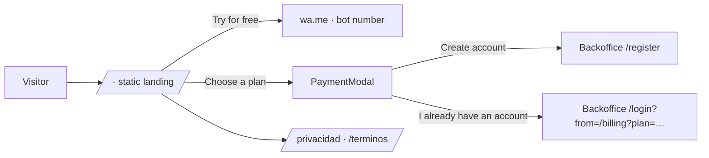

# @none-system/landing

Marketing site for **none-system** built with **Next.js 15 (App Router)**: it presents the WhatsApp accounting assistant, the plans in Colombian pesos and the legal documents required by **Law 1581 of 2012 (Habeas Data)** and **Law 1480 of 2011 (Consumer Protection Statute)**.

---

## 📖 Core Abstract & Functional Overview

| Section | Component | Description |
|---|---|---|
| Hero | `Hero` | Value proposition and direct access to the WhatsApp bot |
| Demo | `InteractiveScanner` | Simulated reading of Colombian receipts with fictitious data |
| Before / after | `BeforeAfter` | Manual process vs. automated process |
| How it works | `HowItWorks` | Photo → data → summary flow |
| Calculator | `RoiCalculator` | Illustrative estimate of hours and money saved |
| Plans | `Pricing` + `PaymentModal` | Plans in COP; purchasing redirects to the backoffice (`/billing`) without asking for card data |
| Trust | `SecurityCompliance` | Official WhatsApp API, DIAN rules and AES-256 encrypted documents |
| FAQ | `Faq` | Quotas, receipt-less expenses, Wompi payments, data deletion |
| Legal | `/privacidad` · `/terminos` (`LegalPage`) | Personal Data Processing Policy and Terms and Conditions |

**Published plans** (`src/lib/plans.ts`):

| Plan | Price | Photo/PDF receipts | Written expenses |
|---|---|---|---|
| Free | $0 COP | 5 per month | 30 per month |
| Independent | $19,900 COP/month | 50 per month | Unlimited |
| Business | $49,900 COP/month | 200 per month | Unlimited |
| Enterprise | $99,900 COP/month | 600 per month | Unlimited |

All plans are monthly, with no minimum term and no automatic renewal.

---

## 🚀 Architectural Runtime Flow



The landing never calls the backend: every page is statically generated and purchases happen in the backoffice under the user's account.

---

## 🗂️ Directory Tree

```text
apps/landing/
├── next.config.mjs               # Security headers (no rewrites: it does not consume the API)
└── src/
    ├── app/
    │   ├── page.tsx              # Main landing page
    │   ├── privacidad/page.tsx   # Data Processing Policy (Law 1581, Decree 1074 of 2015)
    │   ├── terminos/page.tsx     # Terms and Conditions (Law 1480: right of withdrawal and payment reversal)
    │   └── layout.tsx
    ├── components/               # Hero, InteractiveScanner, Pricing, PaymentModal, Faq, Footer, LegalPage…
    └── lib/
        ├── plans.ts              # Plans, prices and benefits
        ├── contact.ts            # Bot number and wa.me / backoffice links
        ├── legal.ts              # Data controller details and policy effective date
        └── utils.ts
```

---

## ⚙️ Provisioning & Setup Guide · Environment Variables

Create `apps/landing/.env.local`:

| Variable | Default | Purpose |
|---|---|---|
| `NEXT_PUBLIC_BACKOFFICE_URL` | `http://localhost:3000` | Target for "Sign in", sign-up and plan purchase |
| `NEXT_PUBLIC_WHATSAPP_NUMBER` | `573009999999` | Bot number (digits only) for `wa.me` links |
| `NEXT_PUBLIC_LEGAL_NAME` | `None System S.A.S.` | Legal name of the data controller |
| `NEXT_PUBLIC_LEGAL_NIT` | `[NIT por definir]` | Data controller's tax ID (NIT) |
| `NEXT_PUBLIC_LEGAL_ADDRESS` | `[Dirección por definir], Bogotá D.C., Colombia` | Registered address |
| `NEXT_PUBLIC_PRIVACY_EMAIL` | `[correo de protección de datos por definir]` | Channel for personal data inquiries and claims |
| `NEXT_PUBLIC_SUPPORT_EMAIL` | `[correo de soporte por definir]` | Channel for complaints, withdrawal requests and support |

Example:
```bash
NEXT_PUBLIC_BACKOFFICE_URL=https://app.none-system.co
NEXT_PUBLIC_WHATSAPP_NUMBER=573001234567
NEXT_PUBLIC_LEGAL_NAME="None System S.A.S."
NEXT_PUBLIC_LEGAL_NIT=901234567-8
NEXT_PUBLIC_PRIVACY_EMAIL=datos@none-system.co
NEXT_PUBLIC_SUPPORT_EMAIL=soporte@none-system.co
```

> [!IMPORTANT]
> Before publishing the site, the real legal entity data must be defined and the `/privacidad` and `/terminos` texts must be reviewed by a lawyer. The public URLs of these pages are the ones the backend sends to users over WhatsApp (`LANDING_URL`).

---

## 🛠️ Technical Stack & Dependencies

| Package | Version | Purpose |
|---|---|---|
| `next` | `^15.1.7` | App Router and static generation |
| `react` · `react-dom` | `^19.0.0` | UI |
| `tailwindcss` | `^3.4.17` | Styling |
| `lucide-react` | `^0.475.0` | Icons |
| `clsx` · `tailwind-merge` | `^2.1.1` · `^3.0.1` | Class composition |
| `typescript` | `^5.8.2` | Strict typing |

---

## 🛠️ Commands

```bash
pnpm dev     # http://localhost:3001
pnpm build   # generates the static pages (/, /privacidad, /terminos)
pnpm start   # production server on port 3001
```

---

## 📈 Performance / Resilience

- **100 % static pages** (`/`, `/privacidad`, `/terminos`): no API calls or backend dependencies at runtime.
- **Zero payment data on the landing**: purchases are delegated to the backoffice and Wompi.
- **Security headers** (`X-Frame-Options: DENY`, `nosniff`, `Referrer-Policy`, `Permissions-Policy`) and the `X-Powered-By` header disabled.

---

> This digital ecosystem has been designed, structured, and developed to high-performance standards by **[Cabuweb](https://cabuweb.com)** - **Software Developer: Diego Villa**.
